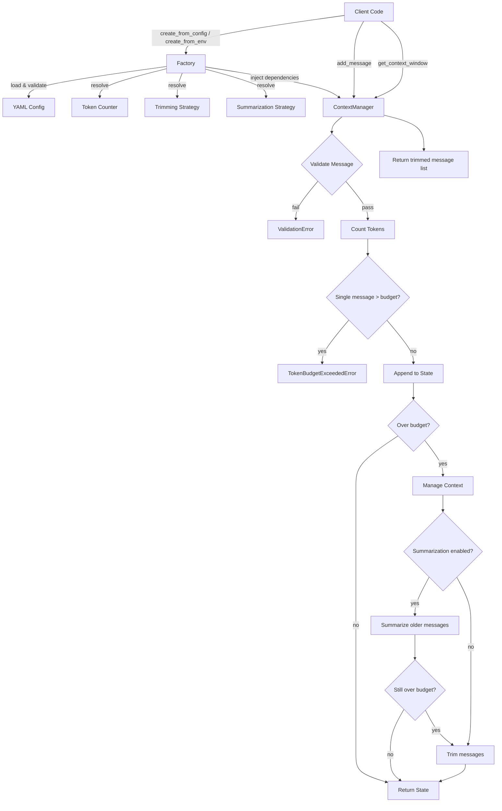

# AI GenAI Context Manager

A framework-agnostic Python utility module for LLM context window management. Provides pluggable strategies for trimming, summarizing, and counting tokens in conversation histories. Supports both OpenAI and Anthropic as configurable providers.

## Features

- **Token Counting**: Accurate counting via tiktoken (OpenAI), Anthropic API, or character-ratio estimation
- **Trimming Strategies**: FIFO, sliding window, and priority-based message trimming
- **Summarization**: LLM-powered conversation summarization via OpenAI or Anthropic APIs
- **Configurable**: YAML-based configuration with environment-specific files (dev/staging/prod)
- **Type-Safe**: Full type annotations with Protocol-based interfaces for extensibility
- **Async-First**: Async primary API with synchronous convenience wrappers

## Project Structure

```
ai-genai-context-manager/
├── pyproject.toml                 # Build config, dependencies, tool settings
├── ruff.toml                      # Linter/formatter configuration
├── .gitignore                     # Python-specific ignore patterns
├── config/
│   ├── config.dev.yaml            # Development environment settings
│   ├── config.staging.yaml        # Staging environment settings
│   └── config.prod.yaml          # Production environment settings
├── src/
│   └── context_manager/
│       ├── __init__.py            # Public API exports
│       ├── py.typed               # PEP 561 type marker
│       ├── _version.py            # Package version
│       ├── config.py              # YAML config loading + Pydantic models
│       ├── exceptions.py          # Custom exception hierarchy
│       ├── logging_setup.py       # Structured logging configuration
│       ├── models.py              # Core data models (Message, TokenCount)
│       ├── protocols.py           # Protocol interfaces for strategies
│       ├── manager.py             # ContextManager orchestrator
│       ├── factory.py             # Config-driven factory functions
│       ├── token_counting/
│       │   ├── openai_counter.py  # tiktoken-based counter
│       │   ├── anthropic_counter.py # Anthropic API counter
│       │   └── estimator.py       # Character-ratio fallback
│       ├── trimming/
│       │   ├── fifo.py            # First-in-first-out trimming
│       │   ├── sliding_window.py  # Keep N most recent messages
│       │   └── priority.py        # Priority-aware trimming
│       ├── summarization/
│       │   ├── openai_summarizer.py    # OpenAI-based summarization
│       │   └── anthropic_summarizer.py # Anthropic-based summarization
│       └── providers/
│           ├── openai_provider.py      # OpenAI API wrapper
│           └── anthropic_provider.py   # Anthropic API wrapper
├── tests/
│   ├── conftest.py                # Shared test fixtures
│   ├── unit/                      # Unit tests (per module)
│   └── integration/               # End-to-end pipeline tests
└── docs/
    └── usage.md                   # Detailed usage guide
```

## Dependencies

| Package | Purpose |
|---------|---------|
| pydantic >=2.7 | Data models and config validation |
| pyyaml >=6.0 | YAML configuration loading |
| tiktoken >=0.7 | OpenAI-compatible token counting |
| openai >=1.40 | OpenAI API client |
| anthropic >=0.34 | Anthropic API client |

**Dev dependencies**: pytest, pytest-cov, pytest-asyncio, pytest-mock, ruff, mypy

## Deployment / Installation

### Prerequisites

- Python 3.12 or higher
- pip or uv package manager

### Install from source

```bash
# Clone the repository
git clone <repository-url>
cd ai-genai-context-manager

# Install in editable mode with dev dependencies
pip install -e ".[dev]"
```

### Environment Variables

Set the following environment variables for API access:

```bash
# Required for OpenAI provider/summarization
export OPENAI_API_KEY="sk-..."

# Required for Anthropic provider/summarization
export ANTHROPIC_API_KEY="sk-ant-..."

# Optional: specify which config file to load (defaults to config/config.dev.yaml)
export CONTEXT_MANAGER_CONFIG_PATH="config/config.prod.yaml"
```

### Configuration

Copy and customize the appropriate environment config:

```bash
# Use the dev config as a starting point
cp config/config.dev.yaml config/config.local.yaml
# Edit settings as needed
```

Key configuration options (see `config/config.dev.yaml` for full reference):

- `provider.name`: "openai" or "anthropic"
- `provider.max_context_tokens`: Context window size
- `trimming.strategy`: "fifo", "sliding_window", or "priority"
- `summarization.enabled`: Enable LLM-powered summarization
- `logging.level`: DEBUG, INFO, WARNING, ERROR, CRITICAL

## Usage

### Quick Start

```python
import asyncio
from context_manager import create_from_config, Message, Role, Priority

async def main():
    # Create a manager from config file
    manager = create_from_config("config/config.dev.yaml")

    # Add a system message (never trimmed)
    await manager.add_message(Message(
        role=Role.SYSTEM,
        content="You are a helpful assistant.",
        priority=Priority.CRITICAL,
    ))

    # Add conversation messages
    await manager.add_message(Message(role=Role.USER, content="What is Python?"))
    await manager.add_message(Message(
        role=Role.ASSISTANT,
        content="Python is a high-level programming language...",
    ))

    # Get the managed context window (trimmed to fit budget)
    context = await manager.get_context_window()

    # Check token usage
    usage = manager.get_token_usage()
    print(f"Using {usage.total} tokens")

asyncio.run(main())
```

### Synchronous Usage

```python
from context_manager import create_from_config, Message, Role

manager = create_from_config("config/config.dev.yaml")
manager.add_message_sync(Message(role=Role.USER, content="Hello!"))
context = manager.get_context_window_sync()
```

### Custom Strategies

```python
from context_manager import ContextManager, load_config
from context_manager.token_counting import TiktokenCounter
from context_manager.trimming import PriorityTrimmingStrategy

config = load_config("config/config.dev.yaml")
manager = ContextManager(
    config=config,
    token_counter=TiktokenCounter(encoding="cl100k_base"),
    trimming_strategy=PriorityTrimmingStrategy(preserve_system_message=True),
)
```

## Development

### Running Tests

```bash
# Run all tests with coverage
pytest

# Run only unit tests
pytest tests/unit/

# Run with verbose output
pytest -v
```

### Linting and Formatting

```bash
# Check for lint issues
ruff check src/ tests/

# Auto-fix fixable issues
ruff check src/ tests/ --fix

# Format code
ruff format src/ tests/
```

### Type Checking

```bash
mypy src/
```

## Architecture

The system uses a **Protocol-based strategy pattern** for extensibility:

- **TokenCounter**: Measures token usage (tiktoken, API, or estimator)
- **TrimmingStrategy**: Removes messages to fit budget (FIFO, window, priority)
- **SummarizationStrategy**: Condenses older messages (OpenAI, Anthropic)

The `ContextManager` orchestrates these strategies via dependency injection. The `factory.py` module provides config-driven convenience constructors.

### End-to-End Flow



## Security

- API keys are read exclusively from environment variables
- Message content is validated against configurable length limits
- Optional control character sanitization
- No `eval()` or dynamic code execution
- All dependencies have pinned version bounds

## License

MIT
